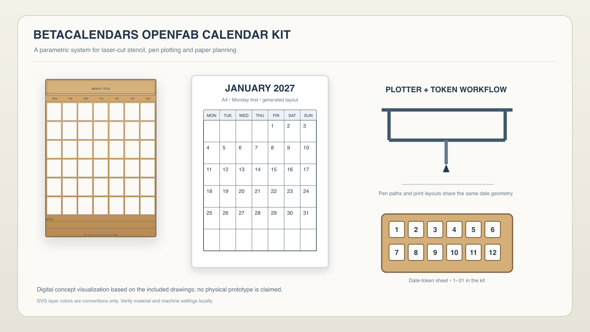

# BetaCalendars OpenFab Calendar Kit

Parametric laser-cut, pen-plotter and printable calendar fabrication system.

An open digital-fabrication toolkit for producing reusable calendar stencils, planning boards, plotter-drawn monthly grids and printable paper planners from deterministic Gregorian geometry. It combines vector fabrication, paper layout and a small dependency-free Python generator for schools, Fab Labs, workshops and personal planning.

**Project website:** https://www.betacalendars.com/  
**Version:** v1.0.0 (digital design release; no physical prototype claimed)



## What is included

- A 190 × 260 mm reusable 7×6 through-cut stencil drawing with a 174 × 180 mm date-grid field, 42 rounded date windows, 2 mm bridges, title band, weekday header, notes lines, and registration marks.
- A 300 × 220 mm reusable planning board drawing.
- Laser token sheets for date numbers 1–31, month names, and Monday-first / Sunday-first weekday labels.
- 12 plotter-oriented 2027 monthly SVG fixtures, each with Monday-first and Sunday-first versions.
- A4 and US Letter single-month PDFs in portrait and landscape, for both week starts.
- Genuine blank 5×7 and 6×7 calendar SVG and PDF templates.
- An AC1015 millimeter-unit DXF stencil drawing with closed date-window contours.
- Fabrication and safety documentation.

## Run the generator

Python 3.9+; no third-party packages are required by the generator. It writes SVG or one-page PDF and supports A4/US Letter, portrait/landscape, fixed/natural grids, a configurable margin, and an optional notes area.

```sh
python3 generator/calendar_kit.py --year 2027 --month 1 --week-start monday --out generated
python3 generator/calendar_kit.py --year 2027 --all-months --week-start sunday --paper-size letter --orientation landscape --grid-mode fixed --format pdf --out generated
python3 generator/calendar_kit.py --blank --rows 6 --week-start monday --out generated
```

Use `--month 1` through `--month 12`, `--week-start monday|sunday`, and `--rows 5|6` for undated grids; `--paper-size a4|letter`, `--orientation portrait|landscape`, `--grid-mode fixed|natural`, `--margin` in millimeters, `--no-notes`, and `--format svg|pdf` control layout and output.

## File map

- `fabrication/laser/` — stencil, board, token SVGs.
- `fabrication/dxf/` — DXF outline and grid.
- `fabrication/plotter/2027/` — dated month SVGs.
- `printable/` — A4 and Letter PDFs.
- `blank/` — undated grids.
- `months/` — month-specific fixture notes.
- `docs/` — design, workflow, safety and validation.
- `images/` — technical visual assets and generated previews.

## Fabrication and safety

Dimensions are nominal and in millimeters. Check stock thickness, kerf, focus, bridge widths, and registration dimensions in your own workflow. Layer colors are conventions only. Follow machine-manufacturer guidance and local Fab Lab rules; settings vary. Do not laser cut PVC, vinyl, or unknown plastics. Never leave a laser unattended. See [`docs/fabrication-guide.md`](docs/fabrication-guide.md).

The SVG/DXF files are digitally validated, not machine-tested. No physical prototype, lab affiliation, or machine-specific compatibility is claimed.

## Licenses

- Documentation and generated layouts: Creative Commons Attribution 4.0 International (CC BY 4.0), see `LICENSE`.
- Generator and source code: MIT, see `LICENSE-CODE`.
- Hardware/vector design files: CERN Open Hardware Licence Version 2 – Weakly Reciprocal (CERN-OHL-W-2.0), see `LICENSE-HARDWARE`.

## Calendar references

See [`docs/month-references.md`](docs/month-references.md). Blank calendar reference: https://www.betacalendars.com/blank-calendar

## Reference pages

The human-readable parent project is https://www.betacalendars.com/. The genuinely undated template reference is https://www.betacalendars.com/blank-calendar.
